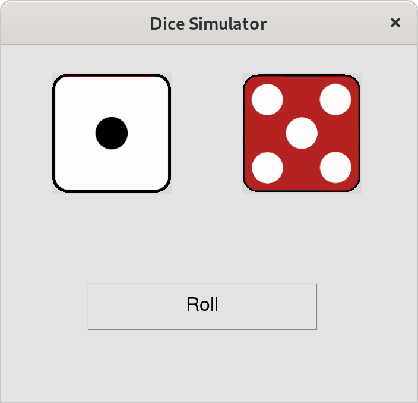

Dice Simulator
----

## 💻 Usage

Run "python dice.py" to execute the program.

Click on the roll button to roll the dices.

## 🔧 Requeriments

- [Python](https://www.python.org/)
- [Tkinter]()
- [Pillow](https://python-pillow.org/)

